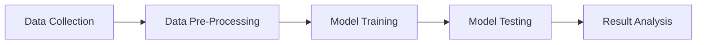

# Title: Churn Classification

## 1. Methodology

## 2. Description
- **Number of Input Records:** 10,000
  - **Churned:** 2,037
  - **Not Churned:** 7,963
- **Data Split:** The dataset is split between training and testing.
- **Model Used:** Artificial Neural Network (ANN) Classification
  - **Architecture:** Sequential Model
  - **Hidden Layers:** 2 ReLU Activation Layers
  - **Output Layer:** Sigmoid Activation Function
- **Implementation:** The model is implemented using TensorFlow.
- **Other Information:** The model was trained on a balanced dataset, and evaluation metrics used is accuracy.

  ## 3. Input / Output

### Input
The input includes the following parameters after data cleaning:
- **Age:** Age of the customer.
- **Gender:** Gender of the customer (Male/Female).
- **Tenure:** Number of months the customer has been with the company.
- **Balance:** The account balance of the customer.
- **Number of Products:** Number of products the customer has subscribed to.
- **Has Credit Card:** Whether the customer has a credit card (Yes/No).
- **Is Active Member:** Whether the customer is an active member (Yes/No).
- **Estimated Salary:** The estimated salary of the customer.
- **Geography:** The country the customer is located in.

### Output
The output is a binary classification:
- **Churned:** The customer has churned (left the service).
- **Not Churned:** The customer has not churned (remained with the service).

