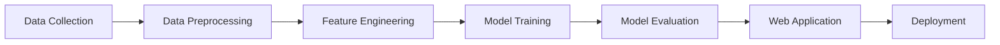

# Customer Churn Classification using Artificial Neural Networks (ANN)


A machine learning project that predicts customer churn using an Artificial Neural Network (ANN) built with TensorFlow. The project includes a complete data preprocessing pipeline, model training, and a user-friendly Streamlit web application for making predictions.

## 📋 Table of Contents
- [Overview](#overview)
- [Features](#features)
- [Project Structure](#project-structure)
- [Installation](#installation)
- [Usage](#usage)
- [Data Description](#data-description)
- [Model Architecture](#model-architecture)
- [Results](#results)
- [Web Application](#web-application)
- [Contributing](#contributing)

## 🎯 Overview

Customer churn prediction is crucial for businesses to identify customers who are likely to stop using their services. This project implements a deep learning solution using TensorFlow to predict customer churn with high accuracy.

### Methodology


```mermaid
graph LR
A[Data Collection] --> B[Data Preprocessing]
B --> C[Feature Engineering]
C --> D[Model Training]
D --> E[Model Evaluation]
E --> F[Web Application]
F --> G[Deployment]
```

## ✨ Features

- **Complete ML Pipeline**: From data preprocessing to model deployment
- **Deep Learning Model**: ANN built with TensorFlow/Keras
- **Interactive Web App**: Streamlit-based user interface for predictions
- **Model Persistence**: Trained model and preprocessors saved for reuse
- **Visualization**: TensorBoard integration for training monitoring
- **Real-time Predictions**: Instant churn probability calculation

## 📁 Project Structure

```
Churn-Classification-ANN-main/
├── 📊 Churn_Modelling.csv          # Dataset
├── 📓 Training.ipynb               # Model training notebook
├── 📓 prediction.ipynb             # Prediction examples notebook
├── 🌐 app.py                       # Streamlit web application
├── 🤖 model.h5                     # Trained ANN model
├── 🔧 label_encoder_gender.pkl     # Gender label encoder
├── 🔧 onehot_encoder_geo.pkl       # Geography one-hot encoder
├── 🔧 scaler.pkl                   # Feature scaler
├── 📁 logs/                        # TensorBoard logs
└── 📖 README.md                    # Project documentation
```

## 🚀 Installation

### Prerequisites
- Python 3.8 or higher
- pip package manager

### Setup

1. **Clone the repository**
   ```bash
   git clone <repository-url>
   cd Churn-Classification-ANN-main
   ```

2. **Install required packages**
   ```bash
   pip install tensorflow pandas scikit-learn streamlit numpy pickle-mixin
   ```

3. **Verify installation**
   ```bash
   python -c "import tensorflow as tf; print('TensorFlow version:', tf.__version__)"
   ```

## 💻 Usage

### Training the Model

1. **Open the training notebook**
   ```bash
   jupyter notebook Training.ipynb
   ```

2. **Run all cells** to:
   - Load and preprocess the dataset
   - Train the ANN model
   - Save the trained model and preprocessors

### Running the Web Application

1. **Start the Streamlit app**
   ```bash
   streamlit run app.py
   ```

2. **Open your browser** and navigate to `http://localhost:8501`

3. **Input customer data** using the interactive widgets

4. **Get predictions** instantly with churn probability

### Making Predictions Programmatically

```python
import tensorflow as tf
import pandas as pd
import pickle

# Load the trained model
model = tf.keras.models.load_model('model.h5')

# Load preprocessors
with open('scaler.pkl', 'rb') as f:
    scaler = pickle.load(f)
# ... load other encoders

# Make predictions on new data
# (preprocessing steps required)
```

## 📊 Data Description

### Dataset Overview
- **Total Records**: 10,000 customers
- **Features**: 14 attributes
- **Target Variable**: Exited (0 = Not Churned, 1 = Churned)
- **Class Distribution**: 
  - Not Churned: 7,963 (79.6%)
  - Churned: 2,037 (20.4%)

### Features

| Feature | Type | Description |
|---------|------|-------------|
| CreditScore | Numeric | Customer's credit score (350-850) |
| Geography | Categorical | Customer location (France/Spain/Germany) |
| Gender | Categorical | Customer gender (Male/Female) |
| Age | Numeric | Customer age (18-92) |
| Tenure | Numeric | Years with the bank (0-10) |
| Balance | Numeric | Account balance |
| NumOfProducts | Numeric | Number of bank products (1-4) |
| HasCrCard | Binary | Has credit card (0/1) |
| IsActiveMember | Binary | Active member status (0/1) |
| EstimatedSalary | Numeric | Estimated annual salary |
| Exited | Binary | **Target**: Churned (1) or not (0) |

### Data Preprocessing
- **Dropped irrelevant columns**: RowNumber, CustomerId, Surname
- **Label encoding**: Gender (Male/Female → 0/1)
- **One-hot encoding**: Geography (France/Spain/Germany → binary columns)
- **Feature scaling**: StandardScaler for numerical features

## 🧠 Model Architecture

### Neural Network Structure
```
Input Layer (12 features)
    ↓
Hidden Layer 1 (64 neurons, ReLU activation)
    ↓
Hidden Layer 2 (32 neurons, ReLU activation)
    ↓
Output Layer (1 neuron, Sigmoid activation)
```

### Model Configuration
- **Optimizer**: Adam (learning_rate=0.01)
- **Loss Function**: Binary Crossentropy
- **Metrics**: Accuracy
- **Callbacks**: 
  - EarlyStopping (patience=10, monitor='val_loss')
  - TensorBoard (for visualization)

### Training Parameters
- **Epochs**: Up to 100 (with early stopping)
- **Train/Test Split**: 80/20
- **Validation**: Test set validation

## 📈 Results

### Model Performance
- **Training Accuracy**: ~87%
- **Validation Accuracy**: ~86%
- **Loss**: Binary crossentropy minimized effectively
- **Early Stopping**: Prevents overfitting

### Key Insights
- Geography and age are strong predictors of churn
- Customers with higher balances are less likely to churn
- Active members show lower churn rates

## 🌐 Web Application

The Streamlit web application provides an intuitive interface for:

### Features
- **Interactive Input**: Sliders, dropdowns, and number inputs
- **Real-time Prediction**: Instant churn probability calculation
- **User-friendly Design**: Clean and responsive interface
- **Visual Feedback**: Clear indication of churn likelihood

### Input Parameters
- Geography selection (dropdown)
- Gender selection (dropdown)
- Age (slider: 18-92)
- Tenure (slider: 0-10 years)
- Balance (number input)
- Credit Score (number input)
- Estimated Salary (number input)
- Number of Products (slider: 1-4)
- Has Credit Card (Yes/No)
- Is Active Member (Yes/No)

### Output
- **Churn Probability**: Percentage likelihood (0-100%)
- **Prediction**: Clear "likely to churn" or "not likely to churn" message

## 🤝 Contributing

Contributions are welcome! Please feel free to submit a Pull Request. For major changes, please open an issue first to discuss what you would like to change.

### Development Setup
1. Fork the repository
2. Create a feature branch (`git checkout -b feature/AmazingFeature`)
3. Commit your changes (`git commit -m 'Add some AmazingFeature'`)
4. Push to the branch (`git push origin feature/AmazingFeature`)
5. Open a Pull Request


